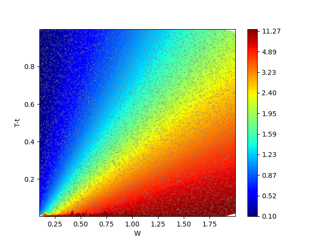
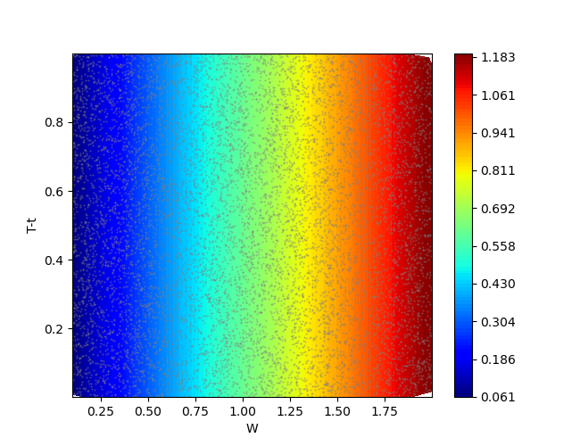
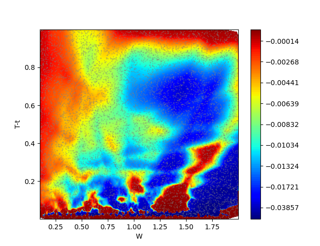
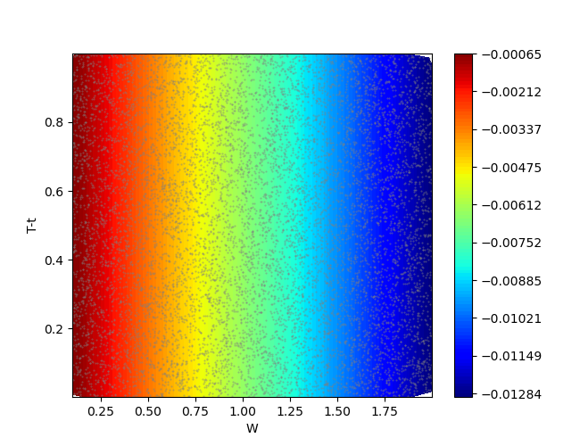
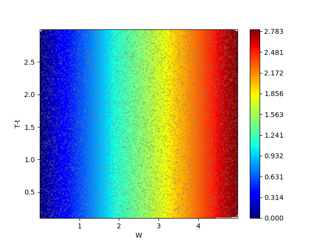
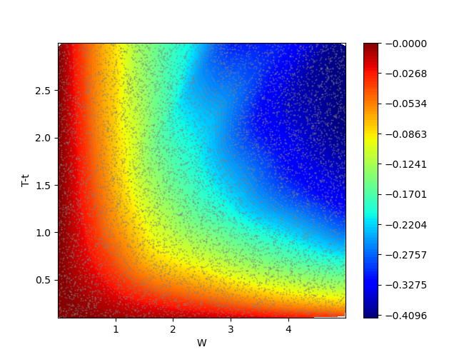
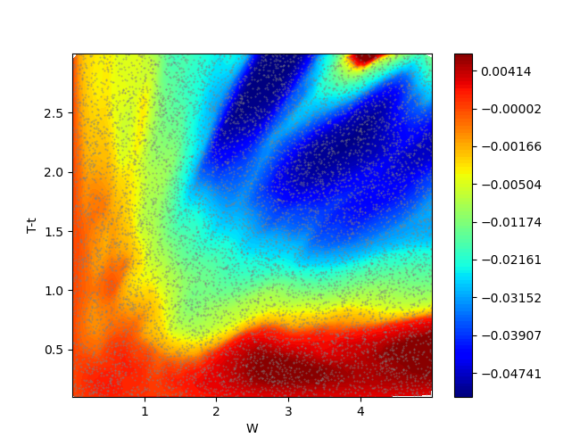

## CGDPO 알고리즘 소개

CGDPO(Computational-Graph-based Direct Policy Optimization)는 dynamic consumption & portfolio choice problem을 풀기 위한 reinforcement algorithm입니다.

본 알고리즘은 다음 연구자들에 의해 개발되었습니다:
* 성균관대 수학과 허정규
* 아주대 금융공학과 구형건
* 성균관대 핀테크융합전공 임병화
* 아주대 금융공학과 김현균
* 전남대 데이터사이언스대학원 정승원

궁금한 점이 있으시면 저자 중 허정규 교수에게 메일(jghuh@skku.edu)로 문의 부탁드립니다. 연구에 참고시 추후 아카이브에 올릴 논문을 꼭 인용 부탁드립니다.

## CGDPO 알고리즘의 특징

CGDPO 알고리즘은 REINFORCE 알고리즘의 변형으로 다음과 같은 특징이 있습니다:
1. 모델 기반 강화학습
2. 정책 기반 강화학습
3. 역전파를 이용한 정책 신경망의 직접 학습
4. 연속 문제 해결을 위한 초기 상태 랜덤 샘플링
5. 오차가 높은 부분을 타개하기 위한 어댑티브 샘플링

## CGDPO와 PPO의 성능 비교

2024년 9월 기준으로 본 알고리즘은 dynamic choice & portfolio choice problem을 푸는 가장 강력한 도구입니다. 강화학습 알고리즘 중 널리 사용되는 PPO 알고리즘과 비교시 상대에러의 관한 RMSE에서 훨씬 우월합니다.

### 완전 시장
| | | 1min | 5min | 10min | 30min | 60min |
|--------|------|------|------|-------|-------|-------|
| consume | ppo | 1.61E+00 | 1.25E+02 | 4.49E+00 | 3.31E+00 | 1.52E+00 |
| | cgdpo | 2.41E+00 | 6.37E-01 | 3.02E-01 | 1.52E-01 | 1.22E-01 |
| myopic | ppo | 1.34E-01 | 1.74E-01 | 1.77E-01 | 2.03E-01 | 2.22E-01 |
| | cgdpo | 3.04E-02 | 1.06E-02 | 6.54E-03 | 3.00E-02 | 1.47E-02 |

### 불완전 시장
| | | 1min | 5min | 10min | 30min | 60min |
|--------|------|-------|-------|--------|--------|--------|
| myopic | ppo | 4.37E+02 | 1.10E+02 | 6.13E+01 | 5.78E+01 | 2.04E+02 |
| | cgdpo | 1.27E+01 | 3.45E-02 | 2.38E-03 | 7.81E-03 | 3.70E-03 |
| hedging | ppo | 8.41E+02 | 1.20E+03 | 4.92E+02 | 5.17E+02 | 3.99E+03 |
| | cgdpo | 4.35E-01 | 1.72E-01 | 2.50E-01 | 2.17E-01 | 1.83E-01 |

여기서는 위험 자산 1개만이 고려되었으며, 완전 시장은 Merton이 최초로 고려한 로그 수익률이 기하브라운운동을 따르는 시장을, 불완전 시장은 Kim & Omberg가 제시한 리스크 프리미엄이 OU process로 움직이는 시장을 의미합니다. 또한 완전 시장에서는 소비가 고려되나, 불완전 시장에서는 소비가 고려되지 않습니다. 이는 Merton과 Kim & Omberg의 원래의 설정을 따르는 것입니다.

PPO 알고리즘은 완전 시장에서도 수렴하지 않고 해답 주변을 순회하는 모습을 보여주며, 불완전 시장에서는 아예 해답과 동떨어진 답을 내놓습니다.

저희 연구진의 견해로는 어떠한 모델이든 적당히 근사적인 답을 원한다면 CGDPO로 10분만 학습하더라도 충분합니다. 만약 정말 정확한 답안을 원한다면 오래 학습할 수록 좋지만, 완전 시장에서는 1시간 이상, 불완전 시장에서는 4시간 이상의 학습을 권장합니다.

정확도를 극도로 높이면 불완전 시장에서 '근시안적 수요'와 '헤징 수요'를 분리하여 구할 수 있습니다.

## CGDPO 알고리즘의 기여

이 알고리즘은 다음의 측면에서 기여합니다:
1. 상대적으로 짧은 시간 안에 불완전시장을 포함한 어떤 모델에서의 정책 신경망 학습을 담보
2. 불완전 시장에서 '근시안적 수요'와 '헤징 수요'를 분리하여 구하는 최초의 연구

## CGDPO 알고리즘의 결과 

### 완전 시장

    
    

왼쪽은 소비량을 예측하는 신경망 결과이고, 오른쪽은 투자량을 예측하는 신경망의 결과물입니다. 5분만에 매우 정확한 답이 도출되고 있음을 확인할 수 있습니다.

에러가 작다는 사실은 매칭되는 아래의 에러에 관한 그림을 봐도 확인됩니다.

    
    

### 불완전 시장

    
    

왼쪽은 근시안적 수요를 예측하는 신경망 결과이고, 오른쪽은 헤징 수요를 예측하는 신경망의 결과물입니다. 1시간이 지나니 두 개의 수요를 분리할만큼 매우 정확한 답이 도출되고 있음을 확인할 수 있습니다.

에러가 작다는 사실은 매칭되는 아래의 에러에 관한 그림을 봐도 확인됩니다.

    
    

